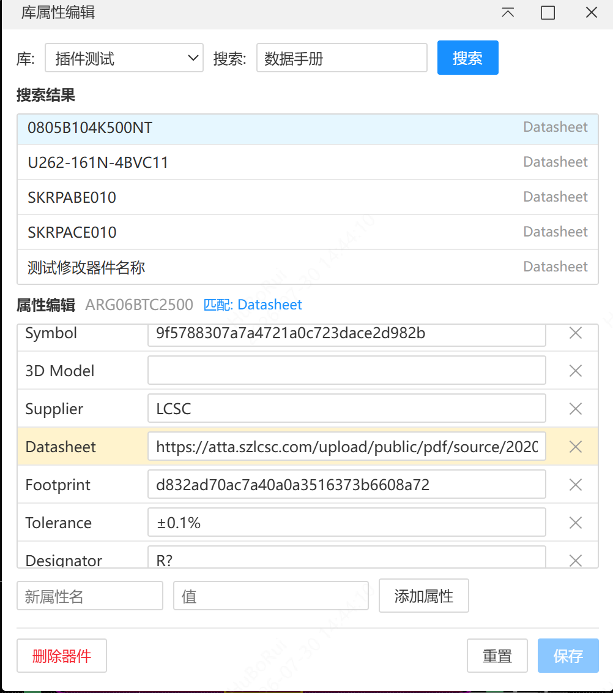
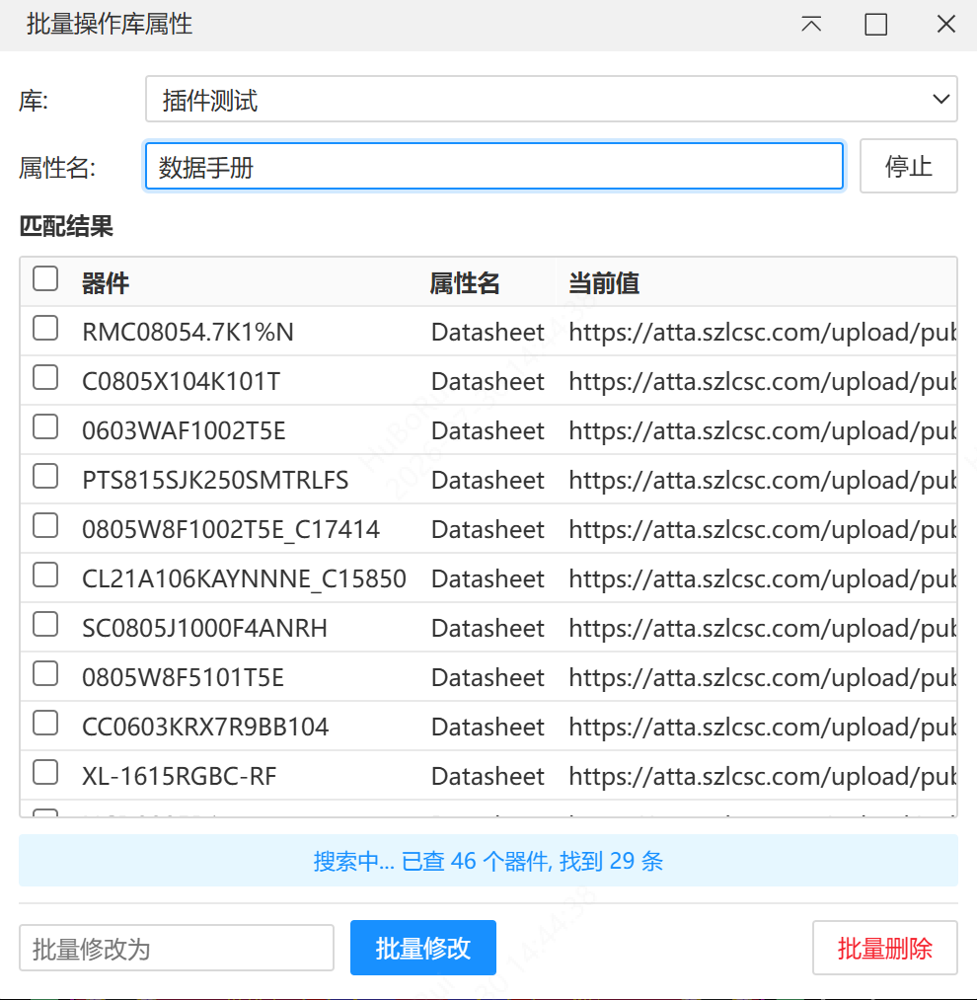

# 库属性编辑 (lib-attr-editor)

嘉立创EDA 专业版扩展，用于搜索库中器件并批量编辑其扩展属性。

## 功能

- **库属性编辑器** — 选择库 → 搜索器件（支持中英文属性名/属性值/器件名）→ 编辑/删除/新增属性 → 保存
- 
- **批量操作库属性** — 搜索指定属性 → 勾选器件 → 批量修改属性值或批量删除属性
- 
- 暗色主题支持
- 库选择记忆（上次选择的库自动恢复）
- 实时搜索进度显示

## 使用

在顶部菜单栏 **库属性编辑** 中选择：

| 菜单项           | 功能                        |
| ---------------- | --------------------------- |
| 打开库属性编辑器 | 单个器件属性查看与编辑      |
| 批量操作库属性   | 跨器件批量修改/删除指定属性 |

## 开发

```shell
npm install
npm run build
node build/import.mjs
```

## 许可

Apache-2.0
